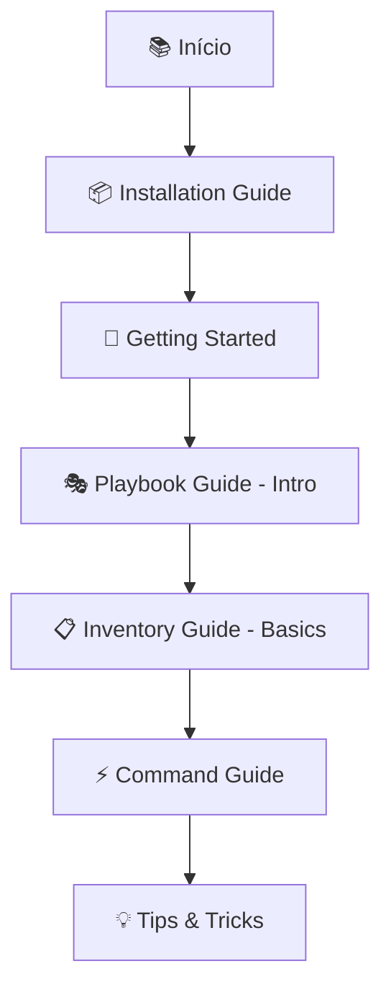
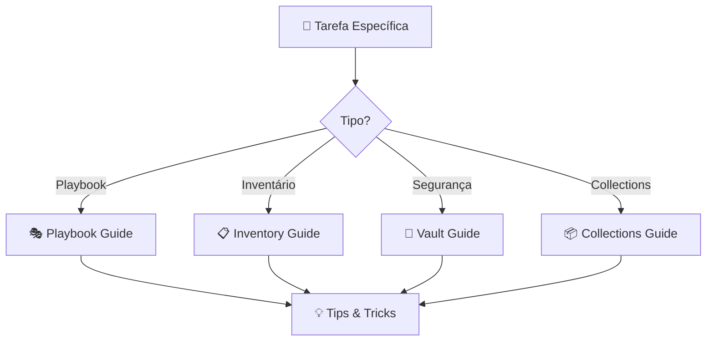
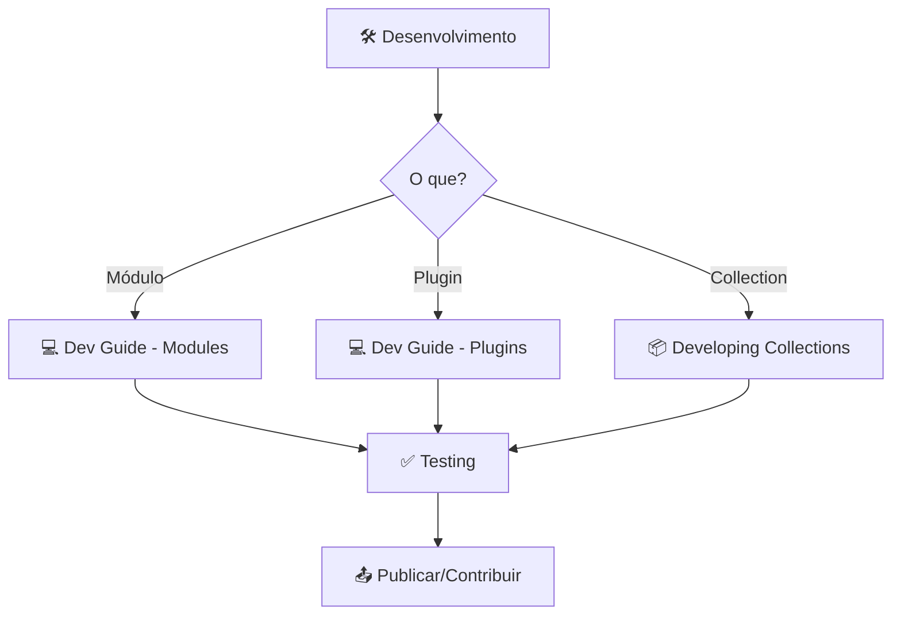

# Guia de Navegação da Documentação Ansible

**Para usuários e contribuidores da documentação Ansible**

Este guia explica como a documentação do Ansible está organizada e como encontrar rapidamente o que você precisa.

---

## 📍 Encontrando o que Você Precisa

### Por Persona / Experiência

#### 🌱 **Sou INICIANTE no Ansible**

**Comece por aqui:**

1. **`/getting_started/`** - Primeiros passos com Ansible
   - O que é Ansible e por que usar
   - Conceitos fundamentais
   - Seu primeiro playbook

2. **`/installation_guide/`** - Como instalar
   - Instalação por distribuição
   - Configuração inicial
   - Verificação da instalação

3. **`/playbook_guide/playbooks_intro.rst`** - Introdução aos playbooks
   - Estrutura básica
   - Primeiros exemplos
   - Melhores práticas iniciais

**Caminho de Aprendizado Sugerido:**
```
Installation → Getting Started → Basic Playbooks → Inventory Basics → Running Commands
```

**Tempo estimado:** 3-5 horas

---

#### 🚀 **Tenho EXPERIÊNCIA INTERMEDIÁRIA**

**Você provavelmente quer:**

1. **`/playbook_guide/`** - Técnicas avançadas de playbooks
   - Loops, conditionals, handlers
   - Templates e variáveis
   - Roles e includes
   - Estratégias de execução

2. **`/inventory_guide/`** - Gestão avançada de inventários
   - Inventários dinâmicos
   - Grupos e variáveis
   - Padrões de organização

3. **`/vault_guide/`** - Segurança e secrets
   - Ansible Vault
   - Gerenciamento de senhas
   - Best practices de segurança

4. **`/collections_guide/`** - Usando collections
   - Instalando collections
   - Usando módulos de collections
   - Requirements files

**Tópicos Úteis:**
- Troubleshooting playbooks → `/playbook_guide/playbooks_error_handling.rst`
- Performance tuning → `/playbook_guide/playbooks_strategies.rst`
- Testing playbooks → `/dev_guide/testing/`

---

#### 🎯 **Quero DESENVOLVER/CUSTOMIZAR Ansible**

**Documentação para desenvolvedores:**

1. **`/dev_guide/`** - Guia completo de desenvolvimento
   - Desenvolvendo módulos
   - Criando plugins
   - Testing e CI
   - Contribuindo para o core

2. **`/collections_guide/`** + `/dev_guide/developing_collections_*`**
   - Criando collections
   - Estrutura de collections
   - Publicando no Galaxy
   - Mantendo collections

3. **`/module_plugin_guide/`** - Referência de módulos e plugins
   - Tipos de plugins
   - APIs disponíveis
   - Documentando módulos

**Recursos Adicionais:**
- API documentation → `/api/`
- Contributing guidelines → `CONTRIBUTING.md`
- Coding standards → `/dev_guide/developing_modules_best_practices.rst`

---

#### 🌐 **Foco em NETWORK AUTOMATION**

**Documentação especializada:**

1. **`/network/getting_started/`** - Introdução à automação de rede
2. **`/network/user_guide/`** - Guias de uso
3. **`/network/dev_guide/`** - Desenvolvimento para rede

**Nota:** A documentação de network está organizada separadamente devido à natureza especializada do conteúdo.

---

#### 🖥️ **Trabalho com WINDOWS**

**Tudo sobre Windows:**

1. **`/os_guide/intro_windows.rst`** - Introdução ao Ansible para Windows
2. **`/os_guide/windows_setup.rst`** - Configuração de hosts Windows
3. **`/os_guide/windows_winrm.rst`** - Configuração WinRM
4. **`/os_guide/windows_faq.rst`** - FAQ Windows

**Desenvolvimento:**
- `/dev_guide/developing_modules_general_windows.rst` - Módulos Windows

---

### Por Tarefa Específica

#### 📦 "Preciso instalar o Ansible"
→ **`/installation_guide/`**

#### 🎭 "Quero escrever playbooks"
→ **`/playbook_guide/`**

#### 📋 "Preciso gerenciar inventários"
→ **`/inventory_guide/`**

#### 🔐 "Quero usar Vault para secrets"
→ **`/vault_guide/`**

#### 🧩 "Quero usar/criar collections"
→ **`/collections_guide/`** (usar) + **`/dev_guide/developing_collections_*`** (criar)

#### ⚡ "Quero entender os comandos CLI"
→ **`/command_guide/`**

#### 🐛 "Meu playbook não funciona (troubleshooting)"
→ **`/playbook_guide/playbooks_error_handling.rst`**
→ **`/reference_appendices/faq.rst`**

#### 📚 "Quero migrar de versão X para Y"
→ **`/porting_guides/porting_guide_X.rst`**

#### 💡 "Quero dicas e truques"
→ **`/tips_tricks/`**

#### 🌟 "Quero publicar no Galaxy"
→ **`/galaxy/`**

#### 🤝 "Quero contribuir para o projeto"
→ **`CONTRIBUTING.md`**
→ **`/community/`**

---

## 🗂️ Estrutura de Diretórios Explicada

### Documentação para USUÁRIOS

| Diretório | Propósito | Quando Usar |
|-----------|-----------|-------------|
| **`getting_started/`** | Primeiros passos | Nunca usei Ansible |
| **`getting_started_ee/`** | Execution Environments | Trabalho com containers/EE |
| **`installation_guide/`** | Instalação | Preciso instalar/configurar |
| **`playbook_guide/`** | Playbooks (principal) | Escrever/melhorar playbooks |
| **`inventory_guide/`** | Inventários | Gerenciar hosts |
| **`command_guide/`** | Comandos CLI | Usar ansible, ansible-playbook |
| **`vault_guide/`** | Segurança/Vault | Proteger secrets |
| **`collections_guide/`** | Usar collections | Instalar/usar collections |
| **`os_guide/`** | SO específico | Windows, BSD, etc. |
| **`network/`** | Network automation | Automação de rede |
| **`tips_tricks/`** | Dicas práticas | Otimizar workflow |

### Documentação para DESENVOLVEDORES

| Diretório | Propósito | Quando Usar |
|-----------|-----------|-------------|
| **`dev_guide/`** | Desenvolvimento | Criar módulos/plugins |
| **`module_plugin_guide/`** | Referência | Entender tipos de plugins |
| **`api/`** | API do Ansible | Integrar programaticamente |
| **`community/`** | Contribuição | Contribuir para projeto |

### Documentação de REFERÊNCIA

| Diretório | Propósito | Quando Usar |
|-----------|-----------|-------------|
| **`reference_appendices/`** | Referências gerais | Lookup rápido |
| **`porting_guides/`** | Migração de versões | Atualizar versão |
| **`galaxy/`** | Ansible Galaxy | Publicar/usar Galaxy |
| **`roadmap/`** | Roadmap do projeto | Acompanhar desenvolvimento |

### ⚠️ Diretórios LEGADOS (Não Use)

| Diretório | Status | Use Em Vez |
|-----------|--------|------------|
| **`user_guide/`** | **DEPRECIADO** | `playbook_guide/`, `inventory_guide/`, etc. |
| **`scenario_guides/`** | **DESCONTINUADO** | Collections específicas |

---

## 🧭 Fluxo de Navegação Típico

### Para Iniciante



### Para Usuário Intermediário



### Para Desenvolvedor



---

## 🔍 Como Pesquisar Eficientemente

### Pesquisa Local com Grep

```bash
# Procurar por termo específico
nox -s grep -- "termo_de_busca"

# Procurar em arquivos RST
grep -r "termo" docs/docsite/rst/ --include="*.rst"

# Procurar por função/módulo
grep -r "win_ping" docs/docsite/rst/
```

### Pesquisa na Documentação Online

- **Site oficial:** https://docs.ansible.com/
- **Busca do site:** Use a barra de pesquisa integrada
- **Google:** `site:docs.ansible.com termo_de_busca`

### Índices Úteis

- **Índice Geral:** `/ansible_index.rst`
- **Índice Core:** `/core_index.rst`
- **Índice por Seção:** `{seção}/index.rst`

---

## 📖 Arquivos Essenciais

### Para Contribuidores

| Arquivo | Descrição |
|---------|-----------|
| **`README.md`** | Como contribuir com a documentação |
| **`CONTRIBUTING.md`** | Políticas de contribuição |
| **`MAINTAINERS.md`** | Informações de mantenedores |
| **`DCO`** | Developer Certificate of Origin |

### Para Desenvolvimento Local

| Arquivo | Descrição |
|---------|-----------|
| **`noxfile.py`** | Configuração de testes e builds |
| **`docs/docsite/rst/conf.py`** | Configuração do Sphinx |
| **`.readthedocs.yaml`** | Configuração Read the Docs |

---

## 🚀 Quick Start: Casos de Uso Comuns

### Caso 1: "Nunca usei Ansible, por onde começar?"

```bash
1. Leia: /installation_guide/intro_installation.rst
2. Leia: /getting_started/get_started_ansible.rst
3. Leia: /getting_started/get_started_playbook.rst
4. Pratique: Execute exemplos do /examples/
5. Avance: /playbook_guide/playbooks_intro.rst
```

---

### Caso 2: "Quero escrever um playbook para configurar servidores web"

```bash
1. Conceitos básicos: /playbook_guide/playbooks_intro.rst
2. Variáveis: /playbook_guide/playbooks_variables.rst
3. Templates: /playbook_guide/playbooks_templating.rst
4. Handlers: /playbook_guide/playbooks_handlers.rst
5. Roles (recomendado): /playbook_guide/playbooks_reuse_roles.rst
6. Exemplo prático: /examples/
```

---

### Caso 3: "Preciso criar um módulo customizado"

```bash
1. Introdução: /dev_guide/developing_modules_general.rst
2. Estrutura: /dev_guide/developing_modules_documenting.rst
3. Best practices: /dev_guide/developing_modules_best_practices.rst
4. Testing: /dev_guide/testing/
5. Exemplo: Veja módulos existentes no ansible/ansible
```

---

### Caso 4: "Quero usar Ansible com Windows"

```bash
1. Introdução: /os_guide/intro_windows.rst
2. Setup: /os_guide/windows_setup.rst
3. WinRM: /os_guide/windows_winrm.rst
4. Módulos: /os_guide/windows_usage.rst
5. FAQ: /os_guide/windows_faq.rst
```

---

### Caso 5: "Quero migrar de Ansible 10 para 11"

```bash
1. Leia: /porting_guides/porting_guide_11.rst
2. Verifique breaking changes
3. Teste em ambiente de dev
4. Atualize playbooks conforme necessário
```

---

## ❓ FAQ sobre Navegação

### P: Por que existem duas estruturas (user_guide e playbook_guide)?

**R:** O `user_guide/` está **depreciado** e foi reorganizado em guias mais específicos (`playbook_guide/`, `inventory_guide/`, `command_guide/`). Sempre use os novos guias. Os arquivos antigos contêm apenas redirecionamentos e serão removidos no futuro.

### P: Onde encontro documentação de módulos específicos?

**R:** Módulos estão documentados no repositório `ansible/ansible`. A documentação aqui foca em **como usar** módulos, não documentação de módulos individuais. Use `ansible-doc nome_modulo` para documentação de módulo específico.

### P: Scenario guides está descontinuado?

**R:** Sim, scenario guides estão sendo **migrados para collections**. Para conteúdo atualizado, consulte as collections relevantes (ex: `amazon.aws`, `community.docker`).

### P: Por que a documentação de network está separada?

**R:** Network automation tem audiência e requisitos específicos. A separação facilita navegação para network engineers e permite foco em conteúdo especializado.

### P: Onde encontro exemplos práticos?

**R:** Exemplos estão em:
- `/examples/` (raiz do repositório)
- Dentro de cada guia (exemplos inline)
- Collections no Galaxy (com exemplos completos)

### P: Como contribuo com a documentação?

**R:** Leia `README.md` e `CONTRIBUTING.md` na raiz do repositório. Use `nox` para validar suas mudanças antes de submeter PR.

---

## 🎓 Learning Paths Recomendados

### Path 1: Fundamentos (5-8 horas)

```
□ Installation Guide
□ Getting Started
□ Basic Playbook Concepts
□ Inventory Basics
□ Running Your First Playbook
□ Variables and Facts
□ Conditionals and Loops
```

### Path 2: Intermediário (10-15 horas)

```
□ Advanced Playbooks
□ Roles and Includes
□ Templates (Jinja2)
□ Handlers and Notifications
□ Error Handling
□ Ansible Vault
□ Collections Basics
□ Best Practices
```

### Path 3: Avançado (15-20 horas)

```
□ Developing Modules
□ Creating Plugins
□ Creating Collections
□ Testing Strategies
□ Performance Tuning
□ CI/CD Integration
□ Contributing to Ansible
```

### Path 4: Network Engineer (8-12 horas)

```
□ Network Getting Started
□ Network Platforms
□ Network Modules
□ Network Best Practices
□ Backup and Restore
□ Advanced Network Automation
```

### Path 5: Windows Admin (6-10 horas)

```
□ Windows Introduction
□ Windows Setup
□ WinRM Configuration
□ Windows Modules
□ Windows Best Practices
□ Troubleshooting Windows
```

---

## 📊 Mapa Visual da Documentação

```
ansible-documentation/
│
├── 🌱 INÍCIO (Novos Usuários)
│   ├── installation_guide/
│   ├── getting_started/
│   └── getting_started_ee/
│
├── 📚 USO DIÁRIO (Usuários Regulares)
│   ├── playbook_guide/ ⭐ PRINCIPAL
│   ├── inventory_guide/
│   ├── command_guide/
│   ├── vault_guide/
│   └── collections_guide/
│
├── 🎯 ESPECIALIZADO (Casos Específicos)
│   ├── os_guide/ (Windows, BSD, etc.)
│   ├── network/ (Network Automation)
│   └── tips_tricks/
│
├── 💻 DESENVOLVIMENTO (Desenvolvedores)
│   ├── dev_guide/ ⭐ PRINCIPAL
│   ├── module_plugin_guide/
│   ├── api/
│   └── community/
│
├── 📖 REFERÊNCIA (Consulta Rápida)
│   ├── reference_appendices/
│   ├── porting_guides/
│   ├── galaxy/
│   └── roadmap/
│
└── ⚠️ LEGADO (Não Use)
    ├── user_guide/ ❌ DEPRECIADO
    └── scenario_guides/ ❌ DESCONTINUADO
```

---

## 🔗 Links Úteis

- **Documentação Online:** https://docs.ansible.com/
- **Repositório Ansible Core:** https://github.com/ansible/ansible
- **Ansible Galaxy:** https://galaxy.ansible.com/
- **Community Forum:** https://forum.ansible.com/
- **Issues:** https://github.com/ansible/ansible-documentation/issues
- **Mailing List:** https://groups.google.com/group/ansible-project

---

## 📞 Precisa de Ajuda?

### Para Perguntas sobre Uso

1. **FAQ:** `/reference_appendices/faq.rst`
2. **Forum:** https://forum.ansible.com/
3. **IRC:** #ansible no Libera.Chat
4. **Mailing List:** ansible-project@googlegroups.com

### Para Bugs/Issues de Documentação

1. **GitHub Issues:** https://github.com/ansible/ansible-documentation/issues
2. Use template adequado
3. Inclua informações de contexto

### Para Contribuições

1. Leia **`CONTRIBUTING.md`**
2. Siga guidelines de estilo
3. Teste com `nox`
4. Submeta PR com descrição clara

---

## 📝 Como Este Guia Está Organizado

Este guia usa os seguintes ícones para facilitar navegação:

- 📦 Instalação e setup
- 🌱 Conteúdo para iniciantes
- 🚀 Conteúdo intermediário
- 🎯 Conteúdo avançado
- 💻 Desenvolvimento
- 🌐 Network automation
- 🖥️ Windows
- 🔐 Segurança
- 📚 Referência
- ⚠️ Atenção/Aviso
- ❌ Depreciado/Não use
- ✅ Recomendado
- ⭐ Essencial/Importante

---

**Última atualização:** 2025-11-22
**Versão do guia:** 1.0
**Feedback:** https://github.com/ansible/ansible-documentation/issues

---

**💡 Dica:** Marque este guia nos favoritos para referência rápida durante seu aprendizado!
