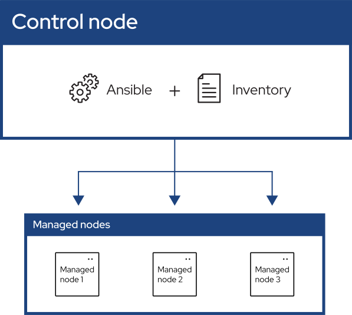

.. _getting_started_index:

############################
Começando com Ansible
############################

O Ansible automatiza a gestão de sistemas remotos e controla seu estado desejado.

Conforme mostrado na figura anterior, a maioria dos ambientes Ansible possui três componentes principais:

Nó de Controle
Um sistema no qual o Ansible está instalado.
Você executa comandos Ansible, como "ansible" ou "ansible-inventory", em um nó de controle.

Inventário
Uma lista de nós gerenciados organizados logicamente.
Um inventário é criado no nó de controle para descrever as implantações de host para o Ansible.

Nó Gerenciado
Um sistema remoto, ou host, controlado pelo Ansible.

.. toctree::
   :maxdepth: 1

   introduction
   get_started_ansible
   get_started_inventory
   get_started_playbook
   basic_concepts
